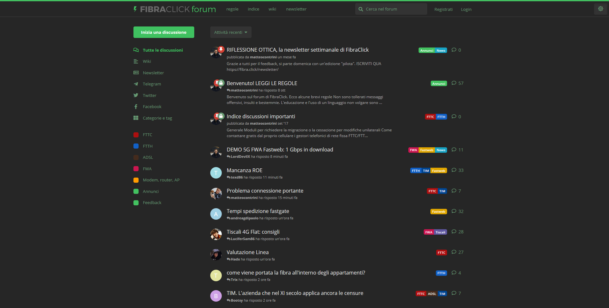

# FibraClick Darkmode

> Modalità scura/notte per il forum di FibraClick

## Installazione

### Installa un gestore di script utente

[Qui](https://greasyfork.org/it/) trovi la lista

### Installa script utente

- [Greasefork](https://greasyfork.org/it/scripts/392711)
- [Github](https://github.com/Nearata/fibraclick-darkmode/raw/master/fibraclick-darkmode.user.js)

## Utilizzo

Una volta installato lo script utente, vi si creerà un bottone in alto a destra per attivare/disattivare la modalità scura.

## License

Distributed under the MIT license. See ``LICENSE`` for more information.

## Contributing

1. Fork it
2. Commit your changes
3. Push to the branch
4. Create a new Pull Request
